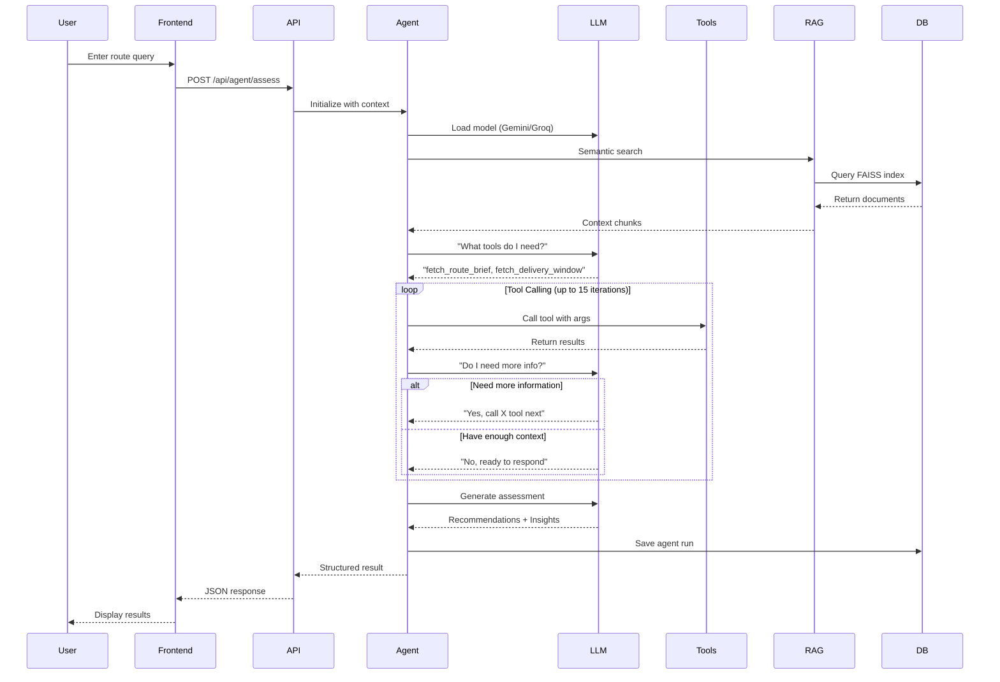
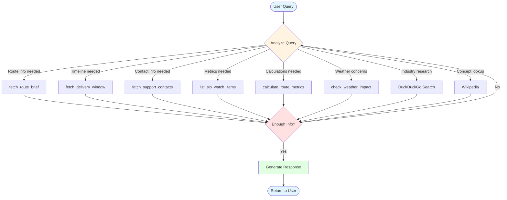

# 🤖 AI Agent Architecture - Visual Diagram

## Complete System Flow

```mermaid
graph TB
    subgraph "Frontend Layer"
        UI[React UI<br/>Agent Panel]
    end
    
    subgraph "API Layer"
        API[FastAPI<br/>/api/agent/assess]
    end
    
    subgraph "Agent Orchestration"
        AGENT[LangChain Agent<br/>AgentExecutor]
        LLM[LLM Provider<br/>Gemini 2.0 / Groq]
        RAG[RAG System<br/>FAISS + Embeddings]
    end
    
    subgraph "Tool Ecosystem"
        subgraph "Internal Tools"
            T1[📋 fetch_route_brief]
            T2[📅 fetch_delivery_window]
            T3[👥 fetch_support_contacts]
            T4[📊 list_slo_watch_items]
            T5[🧮 calculate_route_metrics]
            T6[🌦️ check_weather_impact]
        end
        
        subgraph "External Tools"
            T7[🔍 DuckDuckGo Search]
            T8[📚 Wikipedia]
            T9[📄 ArXiv Papers]
        end
    end
    
    subgraph "Data Layer"
        DB[(PostgreSQL<br/>Agent History)]
        VDB[(FAISS Vector DB<br/>Documents)]
    end
    
    UI -->|POST Request| API
    API -->|Initialize| AGENT
    AGENT -->|Query| LLM
    AGENT -->|Retrieve Context| RAG
    RAG -->|Search| VDB
    
    AGENT -->|Call Tools| T1
    AGENT -->|Call Tools| T2
    AGENT -->|Call Tools| T3
    AGENT -->|Call Tools| T4
    AGENT -->|Call Tools| T5
    AGENT -->|Call Tools| T6
    AGENT -->|Call Tools| T7
    AGENT -->|Call Tools| T8
    AGENT -->|Call Tools| T9
    
    T1 -.->|Results| AGENT
    T2 -.->|Results| AGENT
    T3 -.->|Results| AGENT
    T4 -.->|Results| AGENT
    T5 -.->|Results| AGENT
    T6 -.->|Results| AGENT
    T7 -.->|Results| AGENT
    T8 -.->|Results| AGENT
    T9 -.->|Results| AGENT
    
    AGENT -->|Save Run| DB
    API -->|JSON Response| UI
    
    style AGENT fill:#ff6b6b,stroke:#333,stroke-width:4px
    style LLM fill:#4ecdc4,stroke:#333,stroke-width:2px
    style RAG fill:#45b7d1,stroke:#333,stroke-width:2px
    style T1 fill:#95e1d3,stroke:#333
    style T2 fill:#95e1d3,stroke:#333
    style T3 fill:#95e1d3,stroke:#333
    style T4 fill:#95e1d3,stroke:#333
    style T5 fill:#95e1d3,stroke:#333
    style T6 fill:#95e1d3,stroke:#333
    style T7 fill:#f38181,stroke:#333
    style T8 fill:#f38181,stroke:#333
    style T9 fill:#f38181,stroke:#333
```



## Agent Decision Flow



## Tool Selection Logic



## Real Tool Calling Example

### Scenario: User asks about "express-delivery" route

```
┌─────────────────────────────────────────────────────────────────┐
│ 1. USER REQUEST                                                  │
│ "Is express-delivery ready for Jan 15 launch?"                  │
└──────────────────────────┬──────────────────────────────────────┘
                           │
                           ▼
┌─────────────────────────────────────────────────────────────────┐
│ 2. AGENT INITIALIZATION                                          │
│ • Load Gemini 2.0 Flash LLM                                     │
│ • Load 9 tools (6 internal + 3 external)                        │
│ • Create AgentExecutor (max 15 iterations)                      │
└──────────────────────────┬──────────────────────────────────────┘
                           │
                           ▼
┌─────────────────────────────────────────────────────────────────┐
│ 3. RAG RETRIEVAL (Pre-context gathering)                        │
│ Query: "Express Delivery Route Driver delivery logistics"       │
│ → Retrieved 3 docs from FAISS                                   │
└──────────────────────────┬──────────────────────────────────────┘
                           │
                           ▼
┌─────────────────────────────────────────────────────────────────┐
│ 4. AGENT REASONING LOOP                                          │
│                                                                  │
│ Iteration 1:                                                     │
│   Agent thinks: "I need route details first"                    │
│   🔧 Call: fetch_route_brief("express-delivery")                │
│   ✅ Got: {                                                      │
│        "name": "Express Delivery Route",                        │
│        "summary": "Same-day delivery for urban areas...",       │
│        "audience_role": "Driver",                               │
│        "success_metric": "95% on-time delivery"                 │
│      }                                                           │
│                                                                  │
│ Iteration 2:                                                     │
│   Agent thinks: "Need deployment timeline"                      │
│   🔧 Call: fetch_delivery_window("express-delivery")            │
│   ✅ Got: {                                                      │
│        "window_start": "2025-01-15",                            │
│        "window_end": "2025-01-17",                              │
│        "environment": "production",                             │
│        "freeze_required": true                                  │
│      }                                                           │
│                                                                  │
│ Iteration 3:                                                     │
│   Agent thinks: "What are critical SLOs to monitor?"            │
│   🔧 Call: list_slo_watch_items("express-delivery")             │
│   ✅ Got: {                                                      │
│        "slo_items": [                                           │
│          "Route calculation latency <500ms",                    │
│          "GPS tracking updates every 30 seconds",               │
│          "Customer notifications within 5 seconds"              │
│        ]                                                        │
│      }                                                           │
│                                                                  │
│ Iteration 4:                                                     │
│   Agent thinks: "Should check industry best practices"          │
│   🌐 Call: DuckDuckGo Search("same day delivery best practices") │
│   ✅ Got: "Top results: Real-time tracking, route optimization..."│
│                                                                  │
│ Iteration 5:                                                     │
│   Agent thinks: "I have sufficient context now"                 │
│   💭 Decision: STOP iteration, generate response                │
└──────────────────────────┬──────────────────────────────────────┘
                           │
                           ▼
┌─────────────────────────────────────────────────────────────────┐
│ 5. RESPONSE GENERATION                                           │
│                                                                  │
│ LLM Analyzes all tool results + RAG context:                    │
│                                                                  │
│ ✅ Summary: "Route targets Driver personas, Jan 15-17 window"   │
│                                                                  │
│ 💡 Insight: "The route is technically ready for production      │
│    launch on January 15. However, the critical SLO requiring    │
│    GPS updates every 30 seconds must be actively monitored..."  │
│                                                                  │
│ 📋 Recommendations:                                              │
│    [HIGH] Implement real-time GPS monitoring dashboard          │
│    [HIGH] Set up alerting for 500ms latency threshold           │
│    [MEDIUM] Conduct driver training on new route system         │
│    [MEDIUM] Prepare rollback plan for deployment freeze         │
└──────────────────────────┬──────────────────────────────────────┘
                           │
                           ▼
┌─────────────────────────────────────────────────────────────────┐
│ 6. PERSISTENCE & RESPONSE                                        │
│ • Save to PostgreSQL: AgentRun record                           │
│ • Return JSON with: summary, insight, recommendations, tools    │
│ • Frontend displays results in chat UI                          │
└─────────────────────────────────────────────────────────────────┘
```

## Tool Autonomy Visualization

```
                    🤖 AGENT BRAIN
                         │
        ┌────────────────┼────────────────┐
        │                │                │
        ▼                ▼                ▼
    🧠 DECIDE       🔧 EXECUTE      💭 REFLECT
        │                │                │
        │                │                │
    What tools       Call the tool    Did I get
    do I need?       with correct      enough
                    arguments?        information?
        │                │                │
        └────────────────┴────────────────┘
                         │
                    ✅ or 🔄
            (Stop or Continue Loop)
```

### Key Difference from Previous Implementation

❌ **OLD (Non-autonomous)**
```python
# Hardcoded function calls
brief = fetch_route_brief(route_slug)
window = fetch_delivery_window(route_slug)
contacts = fetch_support_contacts(audience_role)
# Agent never decides - just fixed sequence
```

✅ **NEW (Autonomous with Real Tools)**
```python
# Agent decides dynamically
agent_executor = AgentExecutor(agent=agent, tools=tools)
result = agent_executor.invoke({"query": user_query})
# Agent chooses: which tools, when, and with what args
```

## Tool Power Levels

```
┌─────────────────────────────────────────────────────────────────┐
│                    TOOL CAPABILITIES                             │
├─────────────────────────────────────────────────────────────────┤
│                                                                  │
│  🟢 LEVEL 1: Data Retrieval                                     │
│     • fetch_route_brief         [Internal DB]                   │
│     • fetch_delivery_window     [Internal DB]                   │
│     • fetch_support_contacts    [Internal DB]                   │
│     • list_slo_watch_items      [Internal DB]                   │
│                                                                  │
│  🟡 LEVEL 2: Calculations                                       │
│     • calculate_route_metrics   [Compute on-demand]             │
│     • check_weather_impact      [Simulated API]                 │
│                                                                  │
│  🔴 LEVEL 3: External Knowledge                                 │
│     • DuckDuckGo Search         [Live web search]               │
│     • Wikipedia                 [Reference lookup]              │
│     • ArXiv                     [Academic research]             │
│                                                                  │
│  💜 LEVEL 4: AI-Enhanced (Future)                               │
│     • RAG-powered Q&A           [Vector search + LLM]           │
│     • Multi-agent collaboration [Agent swarms]                  │
│     • Real-time API integration [Weather, Traffic, Fleet]       │
│                                                                  │
└─────────────────────────────────────────────────────────────────┘
```

## Benefits of Real Tool Calling

| Feature | Before | After |
|---------|--------|-------|
| **Autonomy** | ❌ Fixed function calls | ✅ Agent decides dynamically |
| **Flexibility** | ❌ Same sequence always | ✅ Adapts to query |
| **Extensibility** | ❌ Code changes needed | ✅ Just add new tools |
| **Web Search** | ❌ Not available | ✅ DuckDuckGo + Wikipedia |
| **Research** | ❌ Limited to internal data | ✅ External knowledge access |
| **Traceability** | ❌ Manual logging | ✅ Auto-tracked by executor |
| **Error Handling** | ❌ Crashes on error | ✅ Graceful degradation |

## Quick Start

### 1. Environment Setup
```bash
# Required
export GEMINI_API_KEY="your-key-here"
# or
export GROQ_API_KEY="your-key-here"

# Optional (for enhanced search)
export TAVILY_API_KEY="your-tavily-key"
```

### 2. Docker Rebuild
```bash
cd /workspaces/aiinweb-project/logistics-route-planner
docker-compose down
docker-compose up --build
```

### 3. Test the Agent
```bash
curl -X POST http://localhost:8000/api/agent/assess \
  -H "Content-Type: application/json" \
  -d '{
    "route_slug": "express-delivery",
    "launch_date": "2025-01-15",
    "audience_role": "Driver",
    "audience_experience": "intermediate",
    "include_risks": true
  }'
```

### 4. Watch Agent Work
Check backend logs for agent reasoning:
```
🤖 Agent initialized with 9 tools
🔍 RAG search completed: 3 documents
🔧 Tool call: fetch_route_brief
✅ Tool result: Express Delivery Route...
🔧 Tool call: fetch_delivery_window
✅ Tool result: Jan 15-17, Production...
🔧 Tool call: DuckDuckGo Search
✅ Tool result: Best practices...
💭 Agent decision: Sufficient context
✨ Response generated
```

## Architecture Highlights

### 🎯 **Core Innovation**
- **Real LangChain Tools** with `@tool` decorator
- **AgentExecutor** for autonomous decision-making
- **Multi-source knowledge** (internal + external + RAG)

### 🚀 **Power Features**
- Web search for real-time information
- Wikipedia for concept definitions
- Autonomous tool selection
- Iterative reasoning (up to 15 steps)
- Full traceability and audit logs

### 🛡️ **Enterprise Ready**
- Error handling and recovery
- Database persistence
- API rate limiting support
- Comprehensive logging
- Performance monitoring

---

**Next Steps:**
1. Rebuild Docker containers
2. Test with different route queries
3. Monitor tool usage patterns
4. Add custom tools as needed
5. Integrate additional APIs (weather, traffic, etc.)
